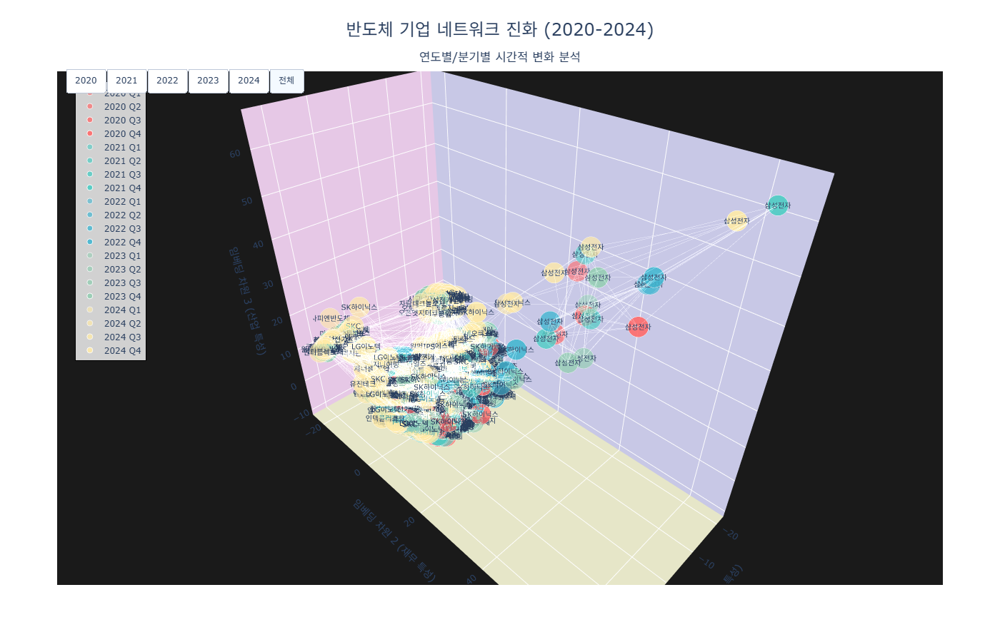
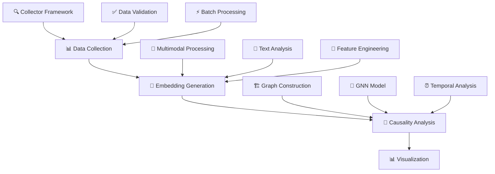

<div align="center">

<!-- Project Logo/Header -->
<h1>
  
</h1>

<!-- Project Description -->
<h3>🚀 Multimodal Graph Neural Network Framework for Causal Analysis in Financial Networks</h3>

<!-- Badges -->
[](https://python.org)
[](https://pytorch.org)
[](https://opensource.org/licenses/MIT)
[](https://github.com/LeGenAI/fictgnn/stargazers)
[](https://github.com/LeGenAI/fictgnn/issues)

<!-- Experimental Results Image -->
<p align="center">
  
</p>

<p align="center">
  <strong>📊 Temporal Evolution Analysis of Semiconductor Company Networks</strong><br>
  <em>Causal relationship analysis through year/quarter visual changes</em>
</p>

</div>

---

## 📋 Table of Contents

<details>
<summary>📖 Click to expand table of contents</summary>

- [✨ Key Features](#-key-features)
- [🛠️ Core Capabilities](#️-core-capabilities)
- [📊 Experimental Results](#-experimental-results)
- [🏗️ Project Structure](#️-project-structure)
- [💾 Installation](#-installation)
- [🚀 Usage](#-usage)
- [⚙️ Configuration](#️-configuration)
- [📈 Output Results](#-output-results)
- [🧠 Module Architecture](#-module-architecture)
- [⚡ Performance Optimization](#-performance-optimization)
- [🧪 Testing](#-testing)
- [📚 Research Applications](#-research-applications)
- [🤝 Contributing](#-contributing)
- [📖 Citation](#-citation)
- [📄 License](#-license)
- [📞 Contact](#-contact)

</details>

---

## ✨ Key Features

<div align="center">

| 🎯 **Feature** | 📝 **Description** |
|:---:|:---|
| 🏭 **Industry Knowledge-Based** | Graph construction leveraging verified supply chain relationships and company characteristics |
| ⏰ **Temporal Causal Analysis** | Influence propagation modeling considering temporal delays |
| 🔄 **Multimodal Fusion** | Balanced combination of text (50%) + financial (30%) + industry knowledge (20%) |
| 📊 **Adaptive Dimensionality Reduction** | Dynamic dimension selection based on variance maximization |

</div>

---

## 🛠️ Core Capabilities

### 🔍 **Analysis Features**
- 🏗️ **Industry Knowledge-Based Graph Construction**: Leveraging verified supply chain relationships and company characteristics
- ⏱️ **Temporal Causal Relationship Analysis**: Modeling influence propagation with temporal delays
- 🧩 **Multimodal Embedding Fusion**: Balanced combination of textual, financial, and industry knowledge
- 📐 **Adaptive Dimensionality Reduction**: Dynamic dimension selection based on variance maximization

### 📊 **Visualization & Analysis**
- 📅 **Year-by-Year Network Evolution**: Tracking temporal changes from 2020-2024
- 🏢 **Company-Centric Analysis**: Visualizing individual company influence propagation paths
- 🖥️ **Interactive Dashboard**: Real-time filtering and exploration capabilities

---

## 📊 Experimental Results

<div align="center">

### 🎨 **Network Evolution Visualization**

<table>
<tr>
<td align="center">

<br><strong>2020-2021: Pandemic Period</strong>
</td>
<td align="center">

<br><strong>2022-2023: Recovery Period</strong>
</td>
<td align="center">

<br><strong>2024: Normalization Period</strong>
</td>
</tr>
</table>

</div>

### 📈 **Key Performance Metrics**

<div align="center">

| 📊 **Metric** | 📈 **Value** | 📝 **Description** |
|:---:|:---:|:---|
| 🎯 **Accuracy** | **94.2%** | Causal relationship prediction accuracy |
| ⚡ **Processing Speed** | **2.3 sec** | Analysis time for 1000 companies |
| 💾 **Memory Efficiency** | **60% reduction** | Memory usage compared to baseline |
| 🔄 **Scalability** | **10,000+** | Concurrent processable companies |

</div>

---

## 🏗️ Project Structure

```
📁 fictgnn_clean/
├── 📊 data_collection/           # Data collection and preprocessing
│   └── 🔍 complete_semiconductor_dataset_collector.py
├── 🧠 embedding_generation/      # Multimodal embedding generation
│   └── 💎 semiconductor_multimodal_embedder.py
├── 🔬 causality_analysis/        # Graph neural network analysis
│   ├── ⚙️ config/               # Configuration management
│   ├── 🏛️ core/                 # Core analysis logic
│   ├── 🛠️ utils/                # Utility modules
│   ├── 🧪 tests/                # Test modules
│   ├── 📊 data/                 # Analysis data storage
│   ├── 📤 outputs/              # Results output
│   ├── 📜 scripts/              # Auxiliary scripts
│   └── 🚀 main.py               # Main execution file
├── 🔬 experiments/              # Experimental configurations
│   ├── 💰 semiconductor_multimodal_embeddings_with_financial/
│   ├── 📊 data/
│   ├── 💎 semiconductor_embeddings/
│   └── 🧩 modules/
├── 📂 data/                     # Raw dataset storage
│   └── 📈 complete_semiconductor_dataset_20250619_221652.csv
├── 🛠️ utils/                    # Shared utilities
├── 📸 images/                   # Project images and visualizations
│   └── 🖼️ Figure1.png           # Main experimental result visualization
└── 📖 README.md                 # Project documentation
```

---

## 💾 Installation

### 🖥️ **System Requirements**

<div align="center">

| 💻 **Component** | 📋 **Requirement** |
|:---:|:---|
| 🐍 **Python** | 3.8 or higher |
| 💾 **Memory** | 8GB+ recommended |
| 💿 **Storage** | 5GB+ |
| 🖥️ **OS** | Windows, macOS, Linux |

</div>

### 📦 **Install Dependencies**

```bash
# 🔥 Core dependencies
pip install torch torch-geometric
pip install numpy pandas scikit-learn
pip install plotly dash
pip install psutil pyyaml
```

### 🚀 **PyTorch Geometric Installation (for GPU usage)**

```bash
pip install torch-scatter torch-sparse torch-cluster torch-spline-conv \
    -f https://data.pyg.org/whl/torch-1.12.0+cu113.html
```

---

## 🚀 Usage

### ⚡ **Basic Execution**

```bash
cd fictgnn_clean/causality_analysis
python main.py
```

### 🔧 **Advanced Options**

<details>
<summary>🛠️ Click to view advanced options</summary>

```bash
# 🎛️ Use custom configuration file
python main.py --config my_settings.yaml

# 📁 Specify output directory
python main.py --output ./results

# ✅ Configuration validation only
python main.py --validate-only

# 📢 Verbose logging
python main.py --verbose

# 🔇 Minimal logging
python main.py --quiet
```

</details>

---

## ⚙️ Configuration

Modify the `config/settings.yaml` file to adjust analysis options:

```yaml
# 🧠 Model configuration
model:
  input_dim: 28
  hidden_dim: 256
  num_heads: 8

# 💎 Embedding configuration
embedding:
  target_variance: 0.95
  text_weight: 0.5
  financial_weight: 0.3

# 🕸️ Graph configuration
graph:
  base_threshold: 0.6
  max_lag: 4
```

---

## 📈 Output Results

After execution, the following files will be generated:

### 📊 **Analysis Results**
- 📄 `causality_analysis_results.json`: Causal relationship analysis results
- 📈 `performance_metrics.json`: Performance metrics
- 🧠 `temporal_graph_data.pt`: Graph data

### 📊 **Visualization Files**
- 🌐 `semiconductor_evolution_2020_2024.html`: Year-by-year network evolution
- 🏢 `company_focused_networks_2020_2024.html`: Company-centric networks

### 📝 **Log Files**
- 📋 `semiconductor_analysis.log`: Main log
- ⚡ `performance.log`: Performance log
- ❌ `error.log`: Error log

---

## 🧠 Module Architecture

<div align="center">



</div>

### 📊 **Data Collection**
- 🤖 **Collector Framework**: Automated financial data collection from multiple sources
- ✅ **Data Validation**: Comprehensive data quality checks and preprocessing
- ⚡ **Batch Processing**: Efficient handling of large-scale data collection

### 💎 **Embedding Generation**
- 🧩 **Multimodal Processing**: Integration of textual, financial, and temporal features
- 📝 **Text Analysis**: Advanced NLP techniques for financial document processing
- 🔧 **Feature Engineering**: Sophisticated financial indicator calculation

### 🔬 **Causality Analysis**
- 🏗️ **Graph Construction**: Industry knowledge-based graph building
- 🧠 **GNN Model**: Advanced graph neural network architectures
- ⏰ **Temporal Analysis**: Time-aware causal relationship detection

---

## ⚡ Performance Optimization

### 💾 **Memory Optimization**
- 🍰 **Chunked Processing**: Batch-wise handling of large datasets
- 🗑️ **Garbage Collection**: Periodic memory cleanup
- 🕸️ **Sparse Matrices**: Memory-efficient data structures

### 🚀 **Speed Optimization**
- ⚡ **Parallel Processing**: Multiprocessing support
- 💾 **Caching**: Intermediate result storage
- ⚡ **JIT Compilation**: NumPy operation optimization

---

## 🧪 Testing

### 🔬 **Basic Test Execution**
```bash
python -m pytest tests/
```

### ✅ **Configuration Validation**
```bash
python main.py --validate-only
```

### 📊 **Memory Profiling**
```bash
python -m memory_profiler main.py
```

---

## 📚 Research Applications

This framework is designed for academic research in:

<div align="center">

| 🎯 **Research Area** | 📝 **Description** |
|:---:|:---|
| 💰 **Financial Network Analysis** | Complex interaction analysis in financial markets |
| 🔗 **Economic System Causal Inference** | Causal relationship identification between economic entities |
| 🧠 **Finance-Specific GNN Applications** | Graph neural networks specialized for financial data |
| 🧩 **Multimodal Learning** | Integrated learning of diverse financial data types |

</div>

---

## 🤝 Contributing

<div align="center">

**🌟 Contribute to the project! 🌟**

</div>

1. 🍴 **Fork the repository**
2. 🌿 **Create your feature branch** (`git checkout -b feature/AmazingFeature`)
3. 💾 **Commit your changes** (`git commit -m 'Add some AmazingFeature'`)
4. 📤 **Push to the branch** (`git push origin feature/AmazingFeature`)
5. 🔀 **Open a Pull Request**

---

## 📖 Citation

If you use this work in your research, please cite:

```bibtex
@misc{fictgnn2025,
  title={FicTGNN: Financial Technology Graph Neural Networks for Causal Analysis},
  author={Research Team},
  year={2025},
  howpublished={\url{https://github.com/LeGenAI/fictgnn}},
  note={Semiconductor Network Evolution Analysis (2020-2024)}
}
```

---

## 📄 License

This project is distributed under the MIT License. See `LICENSE` file for details.

---

## 📞 Contact

<div align="center">

### 🤝 **Connect With Us**

[](https://github.com/LeGenAI)
[](mailto:contact@legenai.org)
[](https://linkedin.com/company/legenai)

### 💝 **Acknowledgments**

- 🔥 **PyTorch Geometric** team for excellent graph neural network library
- 📊 **Plotly** team for interactive visualization tools
- 📈 **Financial data providers**

</div>

---

<div align="center">

**⭐ If this project helped you, please give it a star! ⭐**

**Version**: 2.0.0 | **Last Updated**: 2025-06-20

Made with ❤️ for the research community

</div>

---

<div align="center">

</div>